# Postly Database ERD

```mermaid
erDiagram
    users ||--o| seeker_profiles : has
    users ||--o| employer_profiles : has
    users ||--o{ resumes : owns
    users ||--o{ conversations : owns
    users ||--o{ job_matches : has
    users ||--o{ applications : "applies as seeker"
    users ||--o{ subscriptions : has
    users ||--o{ payments : makes
    users ||--o{ sessions : creates
    users ||--o{ bot_configs : configures
    users ||--o{ notifications : receives
    users ||--o{ audit_log : "generates actions"
    users ||--o{ token_usage : consumes
    users ||--o{ subscription_change_log : "triggers changes"
    users ||--o{ jobs : "posts as employer"

    seeker_profiles ||--|| users : belongs_to

    employer_profiles ||--|| users : belongs_to
    employer_profiles ||--o{ jobs : posts

    resumes ||--o{ job_matches : matches
    resumes ||--o{ conversations : "context for chat"
    resumes ||--o{ applications : submitted_with

    jobs ||--o{ job_matches : matched_to
    jobs ||--o{ applications : applied_to
    jobs ||--o{ bot_posts : dispatched_by

    job_matches }o--|| users : "belongs to seeker"
    job_matches }o--|| resumes : based_on
    job_matches }o--|| jobs : targets

    applications ||--o{ application_status_history : tracks
    applications }o--|| users : "seeker applies"
    applications }o--|| jobs : for
    applications }o--o| resumes : attaches

    application_status_history }o--|| applications : belongs_to

    conversations ||--o{ messages : contains
    conversations }o--|| users : owned_by
    conversations }o--o| resumes : "attached resume"

    messages }o--|| conversations : belongs_to

    bot_configs ||--o{ bot_posts : sends
    bot_configs }o--|| users : configured_by

    bot_posts }o--|| bot_configs : from
    bot_posts }o--o| jobs : references

    subscriptions ||--|| users : belongs_to
    subscriptions }o--|| plan_features : "follows plan"

    plan_features ||--o{ subscriptions : defines

    subscription_change_log }o--|| users : "records changes for"

    payments }o--|| users : paid_by
    payments }o--o| subscriptions : "applied to"

    sessions }o--|| users : belongs_to

    notifications }o--|| users : sent_to

    token_usage }o--|| users : accrued_by

    audit_log }o--o| users : "acted by"

    discord_configs }o--|| users : "[DEPRECATED] owned_by"


    %% ═══════════════════════════════════════════════════════════════════════
    %% ENTITY ATTRIBUTES
    %% ═══════════════════════════════════════════════════════════════════════

    %% ─── Users & Auth ──────────────────────────────────────────────────────
    users {
        uuid id PK
        varchar email "unique"
        varchar password_hash "nullable"
        varchar full_name
        text avatar_url
        user_role roles[] "default: job_seeker"
        boolean is_verified
        timestamptz email_verified_at
        varchar auth_provider "email|google|discord"
        varchar timezone
        varchar locale
        varchar password_reset_token
        timestamptz password_reset_expires_at
        timestamptz last_login_at
        timestamptz deleted_at "soft delete"
        timestamptz created_at
        timestamptz updated_at
    }

    sessions {
        uuid id PK
        uuid user_id FK
        varchar token_hash "unique"
        varchar refresh_token_hash "unique, nullable"
        varchar ip_address
        text user_agent
        timestamptz last_active_at
        timestamptz expires_at
        timestamptz revoked_at
        timestamptz created_at
    }

    otp_codes {
        uuid id PK
        uuid user_id FK "unique"
        varchar code_hash
        timestamptz expires_at
        integer attempts "default: 0"
        timestamptz last_attempt_at
        timestamptz created_at
    }

    %% ─── Profiles ──────────────────────────────────────────────────────────
    seeker_profiles {
        uuid id PK
        uuid user_id FK "unique"
        varchar headline
        text summary
        jsonb skills
        integer experience_years
        varchar experience_level
        jsonb education
        jsonb certifications
        jsonb languages
        jsonb work_history
        jsonb desired_job_titles
        jsonb desired_locations
        decimal desired_salary_min
        decimal desired_salary_max
        varchar desired_job_type
        boolean open_to_remote "default: true"
        boolean open_to_relocation "default: false"
        vector embedding "1024d"
        text prompt_history_summary
        timestamptz last_parsed_at
        timestamptz created_at
        timestamptz updated_at
        timestamptz deleted_at
    }

    employer_profiles {
        uuid id PK
        uuid user_id FK "unique"
        varchar company_name
        text company_website
        text company_logo_url
        text company_description
        varchar company_size
        varchar industry
        varchar headquarters_location
        jsonb social_links
        vector embedding "1024d"
        integer active_job_count "default: 0"
        boolean is_verified "default: false"
        timestamptz created_at
        timestamptz updated_at
        timestamptz deleted_at
    }

    %% ─── Resumes ───────────────────────────────────────────────────────────
    resumes {
        uuid id PK
        uuid user_id FK
        text file_url
        varchar file_hash "SHA-256"
        integer file_size_bytes
        varchar file_mimetype
        text parsed_text
        vector embedding "1024d"
        jsonb skills
        integer experience_years
        jsonb education
        timestamptz created_at
        timestamptz updated_at
        timestamptz deleted_at
    }

    %% ─── Jobs ──────────────────────────────────────────────────────────────
    jobs {
        uuid id PK
        varchar title
        varchar company_name
        text company_logo_url
        text company_description
        text description
        varchar location
        decimal salary_min
        decimal salary_max
        varchar job_type
        boolean remote "default: false"
        job_source source "enum"
        text source_url
        vector embedding "1024d"
        jsonb skills_required
        varchar experience_required
        timestamptz posted_at
        timestamptz expires_at
        boolean is_active "default: true"
        uuid employer_id FK "nullable"
        varchar external_job_id
        varchar fingerprint "dedup key"
        timestamptz created_at
        timestamptz updated_at
        timestamptz deleted_at
    }

    %% ─── Job Matches ───────────────────────────────────────────────────────
    job_matches {
        uuid id PK
        uuid user_id FK
        uuid resume_id FK
        uuid job_id FK
        decimal match_score "0.00-99.99"
        text ai_explanation
        boolean is_saved
        boolean applied
        timestamptz viewed_at
        timestamptz created_at
        timestamptz updated_at
        timestamptz deleted_at
    }

    %% ─── Applications ──────────────────────────────────────────────────────
    applications {
        uuid id PK
        uuid seeker_id FK
        uuid job_id FK "onDelete: restrict"
        uuid resume_id FK "nullable"
        application_status status
        text cover_letter
        text seeker_notes
        text employer_notes
        boolean notify_seeker
        boolean notify_employer
        timestamptz applied_at
        timestamptz created_at
        timestamptz updated_at
    }

    application_status_history {
        uuid id PK
        uuid application_id FK
        application_status from_status "nullable"
        application_status to_status
        uuid changed_by FK
        text note
        timestamptz created_at
        timestamptz updated_at
    }

    %% ─── AI Chat ───────────────────────────────────────────────────────────
    system_prompts {
        uuid id PK
        integer version
        varchar slug
        text content
        boolean is_active
        timestamptz created_at
        timestamptz updated_at
    }

    conversations {
        uuid id PK
        uuid user_id FK
        varchar title
        uuid resume_id FK "nullable"
        varchar model
        integer total_tokens_used
        boolean is_archived
        timestamptz created_at
        timestamptz updated_at
    }

    messages {
        uuid id PK
        uuid conversation_id FK
        message_role role "enum"
        text content
        integer tokens_used
        jsonb metadata
        boolean is_active "default: true"
        timestamptz created_at
        timestamptz updated_at
        timestamptz deleted_at
    }

    %% ─── Bots ──────────────────────────────────────────────────────────────
    bot_configs {
        uuid id PK
        uuid user_id FK
        bot_platform platform
        boolean is_active
        jsonb platform_config "guild_id, channel_id, subreddit, etc."
        jsonb credentials "ENCRYPTED (AES-256-GCM)"
        varchar target_id
        varchar target_name
        text webhook_url
        text[] filter_keywords
        text[] filter_locations
        decimal filter_min_salary
        varchar[] filter_job_types
        text last_error
        integer error_count "default: 0"
        timestamptz last_post_at
        timestamptz last_success_at
        timestamptz created_at
        timestamptz updated_at
    }

    discord_configs {
        uuid id PK
        varchar guild_id "unique [DEPRECATED]"
        varchar channel_id
        uuid user_id FK
        boolean is_active
        timestamptz created_at
        timestamptz updated_at
    }

    bot_posts {
        uuid id PK
        uuid bot_config_id FK
        uuid job_id FK "onDelete: set null"
        varchar external_post_id
        varchar status "sent|failed"
        text error_message
        timestamptz posted_at
    }

    %% ─── Billing ───────────────────────────────────────────────────────────
    subscriptions {
        uuid id PK
        uuid user_id FK "unique, onDelete: restrict"
        subscription_plan plan
        subscription_status status
        varchar dodo_subscription_id "unique"
        varchar dodo_customer_id
        varchar dodo_product_id
        timestamptz current_period_start
        timestamptz current_period_end
        timestamptz trial_ends_at
        timestamptz cancelled_at
        jsonb raw_data
        timestamptz created_at
        timestamptz updated_at
    }

    plan_features {
        subscription_plan plan PK
        integer max_resumes
        integer max_conversations
        integer max_bot_configs
        integer tokens_per_month
        boolean tokens_rollover
        varchar ai_model
        jsonb features
        timestamptz created_at
        timestamptz updated_at
    }

    subscription_change_log {
        uuid id PK
        uuid user_id FK "onDelete: restrict"
        varchar from_subscription_id
        varchar to_subscription_id
        subscription_plan from_plan "nullable"
        subscription_plan to_plan
        varchar reason "upgrade|downgrade|cancel|reactivate"
        timestamptz created_at
    }

    payments {
        uuid id PK
        uuid user_id FK "onDelete: restrict"
        uuid subscription_id FK "nullable"
        varchar dodo_payment_id
        varchar dodo_customer_id
        varchar event_type
        integer amount "USD cents"
        varchar currency "default: USD"
        payment_status status
        varchar payment_method "card|paypal"
        timestamptz paid_at
        jsonb raw_payload
        varchar idempotency_key "unique, NOT NULL"
        timestamptz created_at
    }

    %% ─── Notifications ─────────────────────────────────────────────────────
    notifications {
        uuid id PK
        uuid user_id FK
        notification_channel channel "default: email"
        varchar type "job_alert|welcome"
        varchar subject
        text content "HTML or text"
        varchar to_email
        notification_status status "default: pending"
        timestamptz scheduled_at
        timestamptz read_at
        timestamptz sent_at
        text error_message
        timestamptz created_at
    }

    email_templates {
        uuid id PK
        varchar template_name "unique"
        text subject_template "'Welcome to {{app_name}}!'"
        text html_template
        text text_template "nullable"
        jsonb variables "['name', 'app_name']"
        boolean is_active
        timestamptz created_at
        timestamptz updated_at
    }

    %% ─── System ────────────────────────────────────────────────────────────
    audit_log {
        uuid id PK
        uuid actor_id FK "nullable"
        varchar action
        varchar entity_type
        uuid entity_id
        jsonb details "{before, after}"
        varchar ip_address
        text user_agent
        timestamptz created_at
    }

    token_usage {
        uuid id PK
        uuid user_id FK
        timestamptz window_start
        varchar window_type "default: monthly"
        integer tokens_used "default: 0"
    }
```

## Entity Count: 22 tables

## Enum Types: 10 (user_role, application_status, subscription_status, subscription_plan, payment_status, notification_status, notification_channel, bot_platform, job_source, message_role)

## Vector Columns: 4 (seeker_profiles.embedding, employer_profiles.embedding, resumes.embedding, jobs.embedding)

## Indexes: 25+

## Soft Delete: 5 tables (users, seeker_profiles, employer_profiles, resumes, jobs, job_matches)
